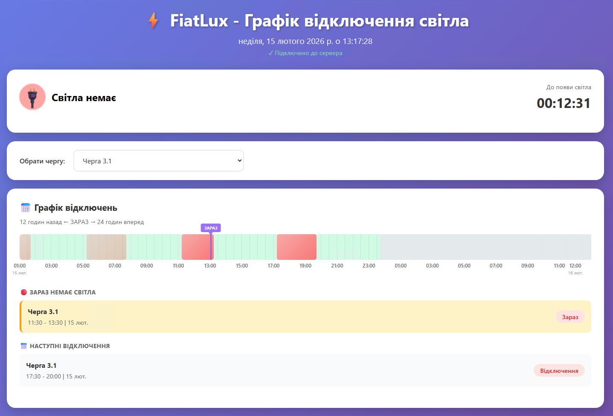

# FiatLux 💡

Сервіс для моніторингу Telegram каналу Черкасиобленерго, який автоматично збирає інформацію про графіки відключень електроенергії і відображає їх у зручному web інтерфейсі.

## Як це працює

1. 🔍 **Моніторинг Telegram** - сервіс підключається до Telegram каналу @pat_cherkasyoblenergo
2. 📥 **Збір даних** - автоматично зчитує нові повідомлення про графіки відключень
3. 🧠 **Парсинг інформації** - розпізнає та структурує дані про відключення по чергах та годинах
4. 🌐 **Відображення** - показує інформацію у зручному web інтерфейсі з 36-годинним таймлайном

## Скриншот



*Web інтерфейс FiatLux з графіками відключень електроенергії*

## ✨ Особливості

### Web Інтерфейс
- 🌐 **Зручний інтерфейс** - перегляд графіків у браузері без додаткових програм
- 📈 **36-годинний таймлайн** - 12 годин назад + поточний момент + 24 години вперед
- 🎨 **Фільтрація по чергах** - виберіть вашу чергу і дивіться тільки актуальну інформацію
- 🔄 **Автоматичне оновлення** - дані оновлюються кожні 30 секунд
- 💾 **Запам'ятовування вибору** - вибрана черга зберігається в браузері
- 🎯 **Кольорове кодування** - червоний (немає світла), зелений (є світло), сірий (немає даних)
- ⏰ **Маркер поточного часу** - фіолетова лінія показує "зараз"

### Технічні можливості
- 🔄 **Real-time моніторинг** - автоматичне відстеження нових повідомлень у Telegram
- 📊 **Розумний парсинг** - автоматичне розпізнавання графіків з української мови
- 🎯 **REST API** - програмний доступ до даних
- 💾 **Оперативне сховище** - збереження даних в пам'яті
- ⚡ **Швидкодія** - мінімальне споживання ресурсів (~50-100MB RAM)

---

## 🚀 Встановлення

### Передумови

- **Windows** з PowerShell 5.1+
- **Linux сервер** з Docker та Docker Compose v2
- SSH доступ до сервера

### Деплой на сервер

```powershell
.\deploy.ps1
```

Інтерактивний скрипт проведе через усі кроки:

1. **Налаштування** — IP сервера, SSH користувач
2. **SSH ключі** — генерація та копіювання (пункт меню `K`)
3. **Деплой** — клонування репо, збірка Docker образу, запуск контейнера (пункт `4`)
4. **Web Setup** — відкрийте `http://<server-ip>:8080/setup.html` у браузері:
   - Введіть `API_ID` та `API_HASH` з https://my.telegram.org
   - Введіть номер телефону
   - Підтвердіть код з Telegram
5. **Готово!** — сервіс автоматично перезапуститься і почне збирати графіки

### Команди меню deploy.ps1

| Пункт | Дія |
|-------|-----|
| `1` | Налаштування конфігурації (IP, користувач) |
| `2` | Переглянути конфігурацію |
| `3` | Перевірити конфігурацію |
| `K` | Налаштування SSH ключів |
| `4` | Повний деплой |
| `5` | Статус контейнера |
| `6` | Запустити контейнер |
| `7` | Зупинити контейнер |
| `8` | Переглянути логи |
| `D` | Видалити все з сервера |

### Після деплою

При перших запусках та повторних деплоях API credentials (API_ID, API_HASH, SESSION_STRING) зберігаються на сервері і не втрачаються.

**Детальна інструкція:** [docs/DEPLOY.md](docs/DEPLOY.md)

---

## 🔌 REST API

Вся документація API та можливість тестування ендпоїнтів доступні через **Swagger UI**:

- **Локально**: `http://localhost:8080/api-docs` (або просто `/docs`)
- **На сервері**: `http://<server-ip>:8080/api-docs`

---

## 📁 Структура проєкту

```
FiatLux/
├── src/
│   ├── api/              # Express API сервер
│   ├── config/           # Конфігурація додатку
│   ├── parsers/          # Парсер графіків відключень
│   ├── storage/          # In-memory сховище
│   ├── telegram/         # Telegram клієнт + авторизація
│   ├── types/            # TypeScript типи
│   ├── utils/            # Утиліти (логер, env менеджер)
│   └── index.ts          # Entry point
├── public/
│   ├── index.html        # Web інтерфейс (таймлайн)
│   └── setup.html        # Telegram setup wizard
├── docs/
│   ├── DEPLOY.md         # Детальна інструкція деплою
│   ├── QUICKSTART.md     # Швидкий старт
│   ├── WEB_SETUP.md      # Налаштування через web інтерфейс
│   └── images/           # Скриншоти
├── docker-compose.yml
├── Dockerfile
└── deploy.ps1            # Windows → Linux deployment
```

---

## 📄 Ліцензія

MIT
